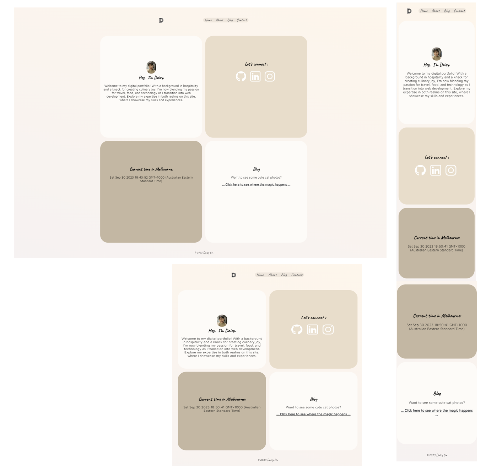
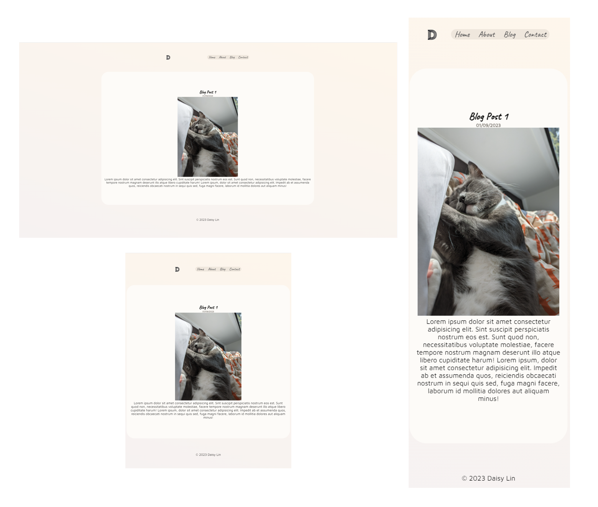

# T1A2 Portfolio Assignment 

## Author: Daisy Lin

Published Website

[GitHub Repository](https://github.com/tira-miso/Tzu-ChunLin_T1A2)


## Purpose of Website
The purpose of this webiste is to uniquely showcase my technical abilities as a potential junior web developer. 
It aims to demonstrate a variety of skills such as HMTL, CSS, as well as basic design principles. Additionally, I am able to share a piece of myself and my experiences with both my trainers and classmates. 

## Functionality/Features
My website is device agnostic and will dynamically adjust using key HTML5/CSS elements such as flexbox. This means users will have a seemless experience regardless of whether they connect via desktop, mobile, or tablet. 

In terms of visual features, I have included multiple ```onhover``` events which highlight the sections with which the user is interacting. I have extensively themed the website to match my personality and style including creating a personalized logo which users can click on to bring them back to the home page.

As per the assignment requirements, I have made sure to include a downloadable version of my resume for potential employers. 

## Sitemap


## Wireframes

Home-Desktop, tablet , mobile


Blog-Desktop, tablet+mobile


Contaxt-Desktop+tablet+mobile


## Screenshots

Home


About


Blog


Contact


## Target Audience
The target audience for this website is my trainers and potential future employers to show them my technical abilities in web design. 

## Tech Stack
This Website will be built entirely in HTML & CSS, and [Vercel](https://vercel.com/) is the platform that has been chosen for deployment. 


